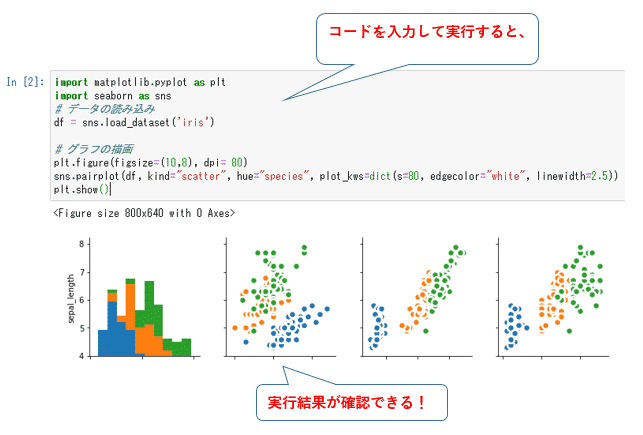
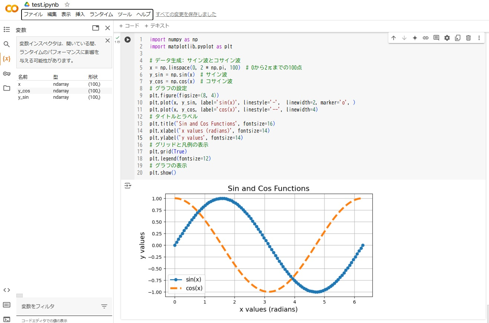
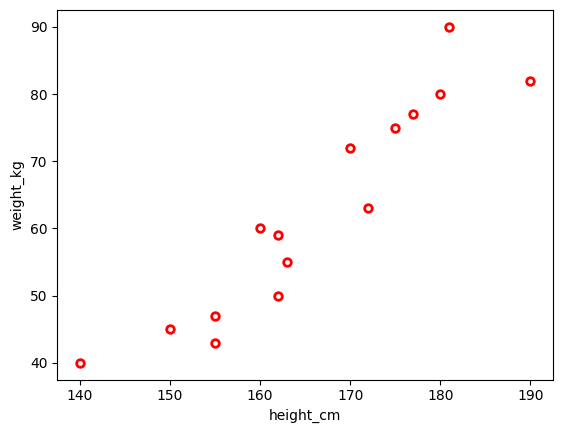

**Pythonプログラミング勉強会**

## Pythonプログラミング基礎編～基礎からデータ解析まで～

1. 変数・出力・文字列・  `f`文字列
2. Pythonの基本データ構造（リスト・タプル・辞書）
3. Pythonの制御文（`if`文・`for`文）
4. Pythonの関数定義・モジュール
5. データ解析やAIに関するPythonプログラミング

### 1. 変数・出力・文字列・  `f`文字列

**Pythonでは、変数がJavaやC言語等のような変数の型の宣言はいらない**

```python
#文字列は、ダブルクォートでもシングルクォートで囲んでもよい
lang = "Python"
county = '九州'

# lang, county = 'Python', '九州' # と書くこともできる。詳しくは「タプル」についての説明を参照

#print()関数で変数や文字列・数値のリテラルを出力する 
print(lang)
print(county)
#出力：
# Python
# 九州
```

**`f文字列`：文字列の前に`f`をつけると「f文字列」と呼ばれ、変数を組み込むことができる**

```python
print(f"lang='{lang}', county='{county}'")
#出力：lang='Python', county='九州'

r = 21
pi = 3.14

print(f"半径={r}, 円周率={pi}, 面積={r*r*pi}")
#出力： 半径=21, 円周率=3.14, 面積=1384.74

#変数にフォーマット(d:整数,f:小数, 小数点や整数の桁数等)を指定できる
print(f"半径={r:03d}, 円周率={pi:.3f}, 面積={r*r*pi:.0f}")
#出力： 半径=021, 円周率=3.140, 面積=1385 

```


### 2. Pythonの基本データ構造（リスト・タプル・辞書）

**2.1 リスト（`list`）：`[要素1, 要素2, ....]`：要素の追加変更可能**

```python
list1 = [1, 2, 3, 4] # 要素の型が同一のリスト
list2 = ['12105番教室', '12107番教室', 12105, 12107] #要素の型が異なるリスト

print(f"list1: {list1}, list1[1]={list1[1]}")
print(f"list2: {list2}, list2[1]={list2[1]}")
#出力：
# list1: [1, 2, 3, 4], list1[1]=2
# list2: ['12105番教室', '12107番教室', 12105, 12107], list2[1]=12107番教室

list1[1] = 5 # 要素の変更
print(f"list1: {list1}, list1[1]={list1[1]}")
#出力：list1: [1, 5, 3, 4], list1[1]=5

#リストを関数の引数として使える。例：sum()関数
print(f"list1: {list1}, sum={sum(list1)}")
#出力：list1: [1, 2, 3, 4], sum=10

#数値ではないリストにsum()関数が適用できない
print(f"list2: {list2}, sum={sum(list2)}")
#エラー：TypeError: unsupported operand type(s) for +: 'int' and 'str'
```

**2.2 タプル（`tuple`）：`(要素1, 要素2, ...)`: 要素の追加変更不可**

```python
import math
a = (1.2, 1.5)
b = (0, 2.1)
# 二点a,b間の距離を求める
d = math.sqrt((a[0]-b[0])*(a[0]-b[0]) + (a[1]-b[1])*(a[1]-b[1]))

print(f"a={a}, b={b}, d={d:.3f}")
#出力：a=(1.2, 1.5), b=(0, 2.1), d=1.342

a[1] = 3.0 # 要素の変更
#エラー：TypeError: 'tuple' object does not support item assignment

#タブルに代入するとき、( )を省略できる
tama, pochi = 'わんこ', 'ねこ'
print(f"tama={tama}, pochi={pochi}")
#出力：tama=わんこ, pochi=ねこ

#従い、スワップを以下のように簡潔に書ける
tama, pochi = pochi, tama
print(f"tama={tama}, pochi={pochi}")
#出力：tama=ねこ, pochi=わんこ
```

**2.3 辞書(`dict`)：`{キー1: 値1, キー2: 値2, ...}`**

```python
words = {'AI' : 'Artificial Intelligence', 'SE': 'System Engineer'}
print(words)
#出力：{'AI': 'Artificial Intelligence', 'SE': 'System Engineer'}

key='AI'
print(f"What does '{key}' mean? '{key}' stands for '{words[key]}'")
#出力：What does 'AI' mean? 'AI' stands for 'Artificial Intelligence'

# 存在しないキーで要素を調べるとエラーになる
print(words['ChatGPT'])
#出力：KeyError: 'ChatGPT'

# get()メソッドで調べると、エラーにならず
print(words.get('ChatGPT'))
#出力：None

# get()メソッドでデフォルト結果を指定して調べる
print(words.get('ChatGPT', 'わからない'))
#出力：わからない
```

**2.4 リスト内包表記（list comprehensions）：リストの要素に処理を適用する**

```python
point = {'S':4, 'A':3, 'B': 2, 'C':1, 'D':0, 'E':0}
grades = ['A', 'S', 'B', 'A', 'D', 'A', 'S']
credits= [2, 2, 4, 2, 2, 1]

# 内包表記で、SABCD表記の成績からポイントへ変換する 
points = [point[g] for g in grades]

print(f"grades={grades}")
print(f"points={points}")
print(f"credits={credits}")

#出力：
# grades=['A', 'S', 'B', 'A', 'D', 'A', 'S']
# points=[3, 4, 2, 3, 0, 3, 4]
# credits=[2, 2, 4, 2, 2, 1]

# GPAを求める
# まず、内包表記で、成績ポイントと単位数を掛け合わせる
grade_points = [p*c for p, c in zip(points, credits)]
print(f"grade_points={grade_points}")
#出力：grade_points=[6, 8, 8, 6, 0, 3]

# 次に、sum()関数を適用して、GPAを計算する
print(f"gpa={sum(grade_points)/sum(credits):.3f}")
#出力：gpa=2.385
```

### 3. Pythonの制御文（`if`文, `for`文）

**3.1 `if elif else`文：文には、`;`や、`{`と` }`を使わない。代わりに、インデントにより、文の構造を示す**

```python
grade = 89
if grade >= 90:
    print(f"点数：{grade}, 判定：S")
elif grade >= 80: 
    print(f"点数：{grade}, 判定：A")
elif grade >= 70: 
    print(f"点数：{grade}, 判定：B")
elif grade >= 60: 
    print(f"点数：{grade}, 判定：C")
else:
    print(f"点数：{grade}, 判定：D")
    
#出力：点数：89, 判定：A
```

**3.2 `for`文**

```python
grades=['A', 'S', 'B', 'A', 'D', 'A', 'S']
# printはデフォルトは改行を付けて出力する
for x in grades:
    print(x)

#出力：
"""
A
S
B
A
D
A
S
"""
# 終了文字を指定して、改行をせず出力する
for x in grades:
    print(x, end=' ')

#出力：A S B A D A S 

#ある範囲の数をrange()関数で発生しながら処理を繰り返す
for x in range(10):
    print(x, end=", ")

#出力：0, 1, 2, 3, 4, 5, 6, 7, 8, 9, 

#0～9までの整数を、2ずつ増やしながら発生する
for x in range(0, 10, 2):
    print(x, end=", ")

#出力：0, 2, 4, 6, 8,     
```

### 4. Pythonの関数定義・モジュール

**4.1 ユーザ関数の定義と呼び出し**

```python
def calc(grade):
    if grade >= 90:
    	return 'S'
    elif grade >= 80: 
        return 'A'
    elif grade >= 70: 
        return 'B'
    elif grade >= 60: 
        return 'C'
    else:
        return 'D'

grade = 89    
print(f"grade={grade},calc(grage)={calc(grade)}")
#出力：grade=89,calc(grage)=A 
```

**4.2 Pythonプログラムファイル（「モジュール」とも呼ばれる）**

**ファイル名：**`foo.py` (`PI`や`calc()`を定義するモジュール)

```python
PI = 3.14159

def calc(grade):
    if grade >= 90:
        return 'S'
    elif grade >= 80: 
        return 'A'
    elif grade >= 70: 
        return 'B'
    elif grade >= 60: 
        return 'C'
    else:
        return 'D'
```

**ファイル名：**`main1.py` (**モジュール`foo`を読み込む**)

```python
# ジュールfooをインポート
import foo
grade = 89

# foo.calc、foo.PIでモジュールfooの名前を使う
print(f"grade={grade},foo.calc(grage)={foo.calc(grade)}")
print(f"foo.PI={foo.PI}")

# VSCodeで実行ボタンを押すか、コマンドラインで以下のコマンドを実行する
# python main1.py
#出力：
# grade=89,foo.calc(grage)=A
# foo.PI=3.14159
```


**ファイル名：**`main2.py` (**モジュール`foo`から`calc`を読み込む**)

```python
# モジュールfooから名前calc, PIをインポート
from foo import calc, PI
grade = 89    

print(f"grade={grade},calc(grage)={calc(grade)}")
print(f"PI={PI}")

# VSCodeで実行ボタンを押すか、コマンドラインで以下のコマンドを実行する
# python main2.py
#出力：
# grade=89,calc(grage)=A
# PI=3.14159
```

### 5. Pythonプログラムの開発環境

Pythonプログラム開発環境の概要を説明する。詳細については、Webで調べたり、AIに聞いたり、自分で構築してみてください。

**5.1 `Jupyter`によるブラウザ上でのPythonプログラミング**



**5.3 クラウド環境(`Google Colaboratory`)上でのPythonプログラミング**



**5.3 `VSCode`等でのPythonプログラミング**

**※この開発環境は、パッケージ開発に向いているが、データ解析等のように図形の出力に向いていない**

**Pythonプログラムの構成**

1. Pythonではプログラムファイルを**モジュール**と呼ばれる
2. ファイル名が`foo.py`のように拡張子を`.py`にする
3. Pythonプログラムのフォルダに`__init__.py`が含まれると**パッケージ**と呼ばれる

**`VSCode`でPythonプログラミング**

1. `VSCode`にPython関連の拡張機能を追加する
2. `VSCode`でプログラムを編集する
3. プログラムを実行する。二つの方法で実行できる
   - `VSCode`画面で実行ボタン（▷）を押す
   - コマンドラインで「`python main1.py`」のようにプログラムを実行する


### 6. データ解析やAIに関するプログラミング

**6.1 パッケージ・ライブラリのインストール**

```sh
# データ解析や機械学習関連
pip install pandas scikit-learn

# 図形出力、ブラウザ上でプログラム実行
pip install matplotlib jupyter

# 形態素解析・然言語処理
pip install mecab-python3 unidic-lite

# 生成AI関連
pip install ollama 
```

**6.2 `Jupyter notebook`を起動し、ブラウザ上でプログラムを編集・実行**

```sh
jupyter notebook
```

**6.2 データの前処理**

```python
"""
ライブラリpandasを使ったcsvデータの読み込み,sepで区切り記号を設定,もし日本語の場合,encodingを設定する必要があり
"""
import pandas as pd
import numpy as np

# 身長と体重データの読み込み
df = pd.read_csv('height_weight_data.csv',sep=',',encoding="utf-8")
df.head()
```


**6.3 データ解析と可視化**

```python
from matplotlib import pyplot as plt

# 身長と体重データの平均値算出 mean
mean_values = df[['height_cm','weight_kg']].mean()
print("平均値")
print(mean_values)

plt.figure(figsize=(8, 5))

# 散布図(scatter)で身長と体重の相関性を可視化
plt.scatter(df.loc[:, ['height_cm']],df.loc[:, ['weight_kg']], c="blue", marker='>')
plt.xlabel(f'身長(cm)', fontname='MS Gothic')
plt.ylabel(f'体重(kg)', fontname='MS Gothic')
plt.show()
```



**6.4 自然言語解析・言語モデルの利用**

```python
"""
MeCabとPythonを使用した日本語テキスト分析入門
事前準備（必要なパッケージをインストール）

pip install mecab-python3
pip install unidic-lite
"""
import MeCab

# MeCab Taggerオブジェクトを作成
mecab = MeCab.Tagger()

# 簡単な日本語の文を分析
text = "私は日本語を勉強しています。"
result = mecab.parse(text)

print(result)

# 出力：
"""
私	ワタクシ	ワタクシ	私-代名詞	代名詞			0
は	ワ	ハ	は	助詞-係助詞			
日本	ニッポン	ニッポン	日本	名詞-固有名詞-地名-国			3
語	ゴ	ゴ	語	名詞-普通名詞-一般			1
を	オ	ヲ	を	助詞-格助詞			
勉強	ベンキョー	ベンキョウ	勉強	名詞-普通名詞-サ変可能			0
し	シ	スル	為る	動詞-非自立可能	サ行変格	連用形-一般	0
て	テ	テ	て	助詞-接続助詞			
い	イ	イル	居る	動詞-非自立可能	上一段-ア行	連用形-一般	0
ます	マス	マス	ます	助動詞	助動詞-マス	終止形-一般	
。			。	補助記号-句点			
EOS
"""
```


```python
"""
pip install ollama
"""
from ollama import chat

text = """
日本語は世界で最も難しい言語の一つだと言われています。
漢字、ひらがな、カタカナという3つの文字体系があります。
また、敬語システムも複雑で、状況に応じて適切な言葉遣いを選ぶ必要があります。
しかし、日本語を学ぶことで、日本の豊かな文化や歴史に触れることができます。
多くの外国人が日本語に魅力を感じ、学習に取り組んでいます。
日本語の習得は確かに難しいですが、努力次第で必ず上達します。
"""

response = chat(
    model="qwen3:8b",
    messages=[{ 'role': 'user', 'content': f'以下の文章を「である」調で100文字程度に要約してください。\n\n{text}' }],
    think=False,  # reasoning model の場合
    options={ "temperature": 0, "num_ctx": 512 }
)
print(f"【結果】：\n{response.message.content}")

# 出力：
"""
【結果】：
日本語は複雑な文字体系と敬語システムを持つが、学ぶことで日本の文化や歴史に触れられるため、多くの外国人が学習に取り組んでいる。努力次第で上達できる言語である。
"""
```

